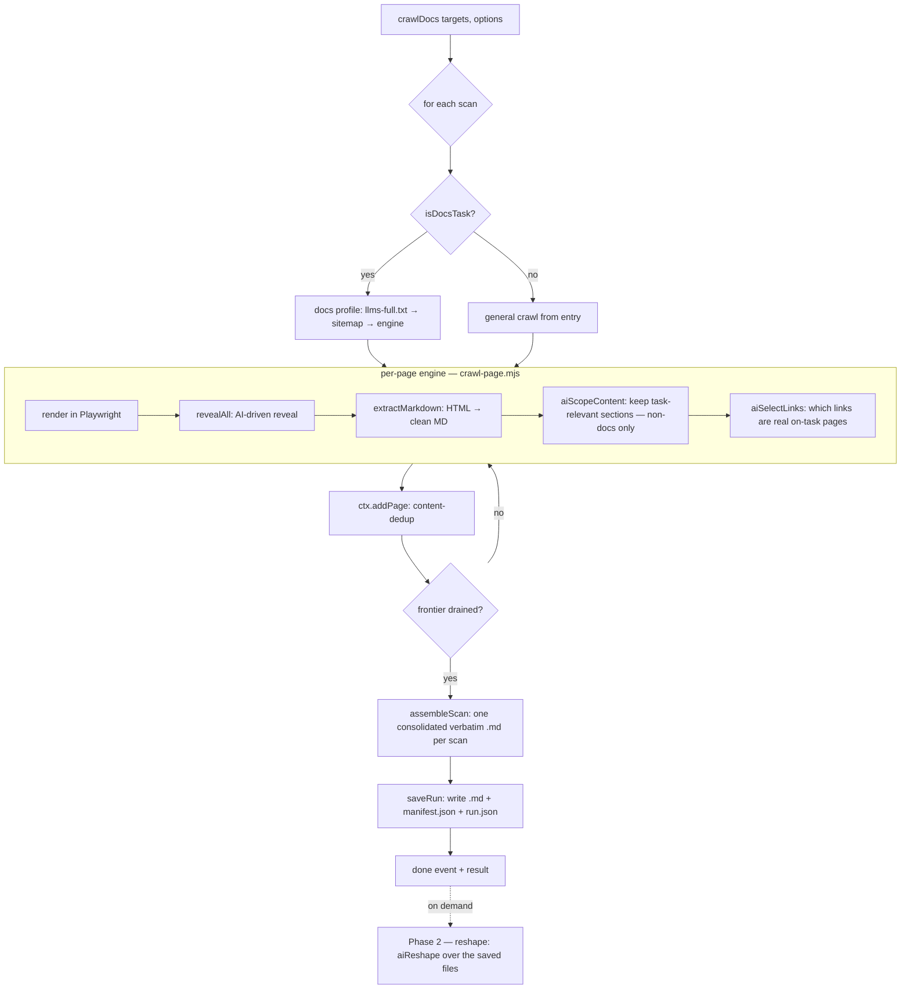

# sagecrawl — How It Works

> A task-driven web crawler that turns any website into clean Markdown, using a
> real browser + a local LLM. This document explains how the system works
> end-to-end as it stands today. For a per-file API reference see
> [`CLAUDE.md`](CLAUDE.md); for the original product spec see
> [`build-spec.md`](build-spec.md).

---

## 1. What it does

You give sagecrawl **one or more URLs** plus a **plain-English task** (e.g. "Extract
all the documentation", "Get the pizza menu", "Put the images in image.md and the
rest in extract.md"). For each site it:

1. **Renders every page in a real headless browser** (Playwright/Chromium) so
   JavaScript-rendered sites and SPAs work — not just static HTML.
2. **Reveals hidden content** — an **AI reads the page's interactive controls
   like a human** and decides which ones hide content (tabs, accordions, "load
   more", variant switches), then clicks them and captures each revealed state.
3. **Discovers pages beyond the DOM** — mines JS/JSON route blobs, sitemaps and
   `llms-full.txt`, and lets the AI decide which links are real, on-task pages.
4. **Stays on-task with AI** — the crawl keeps only the sections the task asks
   for, **verbatim**, as one faithful `.md` per link. Turning that into tables,
   splits or filtered subsets is a separate, optional **Phase 2 — reshape** (§7.4):
   a chat over the saved files you can reuse any number of times.

### Guiding principles

- **Precision over speed, always.** Slow is fine; never miss content.
- **Universal, not per-site.** One general AI-driven algorithm for *any* site —
  no per-framework/per-site special cases. Lean on AI for generality.
- **Two phases, cleanly separated.** The **crawl** (Phase 1) only ever decides
  *what to keep* and never rewrites content — its output is verbatim by
  construction. *How to present it* — tables, splits, filtered subsets — is
  **Phase 2 (reshape)**, run on demand over the saved files. The crawl can't
  reshape; reshape can't change what was crawled.
- **AI reads the user's task, regex reads nothing about the website.** The few
  deterministic backstops interpret the user's *English instruction* (a reliable
  fallback when the local model hedges); they never hard-code website structure.

---

## 2. Core concepts

| Term | Meaning |
|------|---------|
| **Target** | `{ url, task }`. The unit of work the caller submits. |
| **Scan** | One submitted link's crawl: its own pages, its own dedup, its own output files. A run can hold several scans. |
| **Run** | The container for one invocation: one folder on disk with a subfolder per scan, plus `manifest.json` and `run.json`. |
| **Task** | The natural-language instruction for the crawl — purely *what to extract* (the scope). |
| **Page** | A crawled+extracted page: `{ url, task, title, markdown, meta }`. |
| **Reshape** | Phase 2: an on-demand chat over a saved scan's files that emits new, derived `.md` files (a table, a split, a filtered subset). |
| **Event** | A streamed progress object (`site`, `page`, `action`, `extracted`, `progress`, `warn`, `saved`, `done`, …). |

---

## 3. The pipeline at a glance



Everything outside this core (the CLI, the Web UI, the sibling `refdna` project)
is just a **consumer** of `crawlDocs`. No crawling logic lives outside the core.

---

## 4. Entry points

All three faces call the same core, [`crawlDocs`](src/index.mjs):

- **CLI** — [`bin/cli.mjs`](bin/cli.mjs). `sagecrawl <url> --task "..."`, plus
  `serve` (Web UI) and `runs` (cache management). Renders the event stream to the
  terminal.
- **Web UI** — [`ui/server.mjs`](ui/server.mjs) + [`ui/index.html`](ui/index.html).
  A `node:http` server with Server-Sent Events for live progress and a small REST
  surface over the runs cache.
- **Library** — `import { crawlDocs } from 'sagecrawl'`. Returns a `run` object that
  is async-iterable (events), exposes `run.result` (a Promise), and `run.stop()`.

```js
const run = crawlDocs(
  [{ url: 'https://example.com', task: 'Extract the pricing as a table' }],
  { model: 'qwen3-coder:30b', browser: 'auto' },
);
for await (const ev of run) console.log(ev.type);
const result = await run.result;   // { scans, stats, warnings, run }
```

---

## 5. Orchestration ([`src/index.mjs`](src/index.mjs))

`crawlDocs` builds one **scan** per target and runs them in sequence. For each
scan it:

1. Emits a `site` event.
2. **Interprets the task once** → `ctx.directives` (cached per task string). See §7.1.
3. Chooses a strategy:
   - `isDocsTask(task)` (matches *documentation / docs / api reference*) →
     **docs profile** ([`src/profiles/docs.mjs`](src/profiles/docs.mjs)).
   - otherwise → **general crawl** (`runGeneralCrawl`).
4. After the frontier drains, **plans the output files** (§8) and **saves the run**.

**`ctx`** is the shared context passed everywhere. It carries `options`, the
active scan, the interpreted `directives`, progress counters, and helper methods:
`emit`, `shouldStop`, `beginScan`, `setTotal`, `markProcessed`, `addPage`,
`runEngine`.

### Frontier & concurrency (`runGeneralCrawl`)

A bounded worker pool (default `concurrency: 4`) drains a URL frontier:

- Each URL is rendered + revealed in its **own browser context**, so pages crawl
  in parallel.
- Discovered links are normalized, scoped (`inScope` + optional `scopePrefix` +
  `include`/`exclude`), de-duplicated, and enqueued.
- **Bootstrap recovery:** if the entry yields no pages (a 404 section root or an
  SPA with no static links), it discovers from the site root once and follows its
  navigation.
- Progress = *work processed* (not pages kept), so the bar always reaches 100%
  even when pages are deduped or empty.

### Dedup & exclusion enforcement (`ctx.addPage`)

Every page from **every source** (llms-full, sitemap, engine, static fallback)
funnels through `addPage`, which is the single chokepoint that:

1. **Enforces the scan's element exclusions** (e.g. "no images") via
   `applyExclusions` — *before* hashing, so dedup sees what the output will.
2. **De-duplicates** by a content signature (links/URLs/whitespace stripped, then
   SHA-1) so the same page reached via throwaway query params collapses.
3. Records the page and emits an `extracted` event.

---

## 6. The discovery & reveal engine

This is the per-page heart of the crawler, in [`src/engine/`](src/engine/).

### 6.1 Render ([`crawl-page.mjs`](src/engine/crawl-page.mjs))

Opens a fresh Playwright page, navigates (`domcontentloaded`), waits for network
idle and for a client-rendered app to actually paint real content, then hands off
to the reveal pass. Popups are recorded and closed. If a browser can't launch it
degrades to a **static fallback** (plain fetch + extraction; emits a warning that
completeness isn't guaranteed).

### 6.2 Perceive ([`perceive.mjs`](src/engine/perceive.mjs))

Runs in the page and returns a structured snapshot of the **main content area**
(densest text container, with site chrome — nav/header/footer/sidebars —
excluded). It produces:

- **Candidate controls** — casts a *wide* net over anything interactive (buttons,
  `[role]`, `[aria-*]`, `[onclick]`, `summary`/`details`, elements with a click
  listener caught by the sniffer injected in [`browser.mjs`](src/lib/browser.mjs),
  `cursor:pointer`, tab/accordion-ish classes). Each candidate carries metadata
  for the AI: `kind` (tab/expander/loadmore/control), `label`, `cls`, nearest
  **heading context**, and a `heuristic` flag (the fallback verdict). Only
  universally-non-content actions (copy/share/print/theme) are hard-filtered out.
- **Links** — *every* destination on the page (nav/footer included), verbatim. No
  URL-shape assumptions; the AI decides which are real pages.
- **Routes** — paths mined from inline scripts / `__NEXT_DATA__` / JSON blobs
  (pages that exist "in the code" but not the DOM).
- **Consent buttons** — for one-time overlay dismissal.

### 6.3 Reveal ([`reveal.mjs`](src/engine/reveal.mjs)) — **AI-driven**

The loop that exhaustively surfaces hidden content:

1. Dismiss cookie/consent overlays once; capture the **baseline** state.
2. Each pass: perceive → collect links/routes → **`aiSelectRevealers` triages the
   candidates** (§7.4): the model reads each control like a human and decides
   which actually hide content. Verdicts are **cached per control signature**;
   controls that only appear *after* a reveal are triaged in the next pass —
   batched waves, **not** a per-click model loop.
3. Click the next approved, un-actioned control:
   - **tab / expander** → click, capture the new state (tagged with the tab label
     so mutually-exclusive variants are all kept).
   - **load more** → click repeatedly until it stops yielding content.
   - a click that navigates → recorded as a discovered link, not a reveal.
4. When no approved controls remain, **scroll** to pull in lazy content, then stop.
5. **`BlockAccumulator`** (in [`extract.mjs`](src/extract.mjs)) accumulates the
   *new* Markdown blocks from each state, de-duplicated by a normalized SHA-1 hash,
   in capture order.

**Reliability:** if the model is unavailable, reveal falls back to the
per-candidate `heuristic` flag, so coverage never drops below the old
selector-based behaviour. A per-page **action budget** (`maxActions`) bounds it.

### 6.4 Extract & clean ([`extract.mjs`](src/extract.mjs))

Converts an HTML state to clean Markdown:

- Picks the densest main-content node; strips chrome (nav/aside/footer, cookie
  banners, edit-this-page toolbars, carbon ads, permalink anchors…).
- **Drops data-URI / inline-SVG images** (``):
  these are decorative encoded blobs that carry no readable text and shatter into
  garbage Markdown. Real `http(s)` images are kept. `stripSvgNoise` is a final
  safety net for SVG markup that leaks as text.
- Converts with Turndown (fenced code blocks with language hints + GFM tables),
  absolutizes links/images, and strips in-article toolbar phrases.

---

## 7. The AI judgment layer ([`src/engine/decide.mjs`](src/engine/decide.mjs))

All prompts to the local Ollama model live here. The **Phase 1** functions
(scope / links / reveal) are verbatim-safe and **completeness-biased** (when
unsure, keep / follow / reveal); the **Phase 2** function (`aiReshape`) is the one
that reworks content, on demand and value-faithfully. Every call degrades
gracefully on failure.

### 7.1 `aiScopeContent` — keep only task-relevant sections *(Phase 1)*

For **non-documentation** tasks, splits the page into heading sections and asks
the model which to keep (dropping nav/footer/cookie/marketing/unrelated). Output
is the **original text** of the kept sections — never rewritten. Empty/uncertain
→ keep everything. (Documentation pages are kept whole.) This is the **"stay
focused"** step — for "the documentation" it drops the landing page, footer and
pricing so the crawl never wastes time on off-task content. It never transforms;
anything that *filters by value/row, reshapes, or regroups* ("only the available
slots", "prices as a table") is **Phase 2** (`aiReshape`, §7.4).

### 7.2 `aiSelectLinks` — which links are real, on-task pages *(Phase 1)*

Given every raw destination verbatim, the model recognises real pages (normal
URLs, SPA fragment routes `#/contact`, query routes `?view=pricing`, pagination)
versus same-page anchors and off-task links — **without the algorithm hard-coding
any URL-shape rule**. Cached per href; follows everything on failure.

### 7.3 `aiSelectRevealers` — which controls hide content *(Phase 1 — the discovery core)*

Reads the candidate controls (kind/label/class/heading-context) and returns those
that, when clicked, reveal hidden readable content — rejecting copy/share/theme
toggles, demo widgets (date pickers, sliders), and plain navigation. Returns
chosen signatures, or `null` to signal the reveal loop to use its heuristic
fallback.

### 7.4 `aiReshape` — reshape the extraction on demand *(Phase 2)*

The **only** place verbatim is relaxed — and it runs **after** the crawl, never
during it, over the **saved** files (so the crawl stays a pure, faithful
extraction). Given a scan's assembled corpus plus the conversation so far, it
answers a request like a knowledge-base query: it may **filter** ("only the special
pizzas", "only the available slots"), **reshape** ("as a table"), **regroup** ("by
day") and **split** into several files. **Value-faithful** — every kept
name/number/price/time/string is copied exactly; it never invents or alters a
value. It emits deliverables as **file blocks** —

```
===FILE: prices.md===
…markdown…
===END===
```

— and any prose outside the blocks is the chat reply (a pure question comes back
reply-only). Orchestrated by [`src/reshape.mjs`](src/reshape.mjs): it loads the
scan's verbatim files (front-matter stripped, capped for context), calls
`aiReshape`, saves each produced file under `<scan>/chat/`, and appends the turn to
that scan's session — so the same extraction is reused across many reshapes without
re-crawling. The crawl's own files are never modified.

---

## 8. Output layout ([`src/lib/layout.mjs`](src/lib/layout.mjs))

After a scan's frontier drains, **`assembleScan`** turns its kept pages into **one
consolidated, verbatim `.md`** — every page's Markdown concatenated in crawl order
under a small YAML front-matter header (task, timestamp, source URLs). When a scan
spans multiple pages, each page's content is introduced by a heading (its title)
and a `_Source:_` line so provenance is clear — a structural header only; the page
content itself is untouched. Nothing is split, filtered or reshaped here: that is
**Phase 2** (§7.4), which writes its derived files separately under `<scan>/chat/`.

Each output file is `{ filename, title, markdown, bytes, pages: string[] }`.

---

## 9. Persistence ([`src/lib/runs.mjs`](src/lib/runs.mjs), [`output.mjs`](src/lib/output.mjs))

A run is written to the cache **only when the caller opts in.** The **CLI and Web
UI always do** (they are apps, so `sagecrawl runs` / Reshape can find the run later); a
**library** call to `crawlDocs` writes **nothing** unless you pass `save: true` or a
`cacheDir` — its full result is returned in memory instead (`scans[].files[].markdown`),
to save wherever you like. The cache root defaults to the **current working
directory** (`<cwd>/.sagecrawl/runs/`), overridable with `cacheDir` / `--cache-dir` /
`SAGECRAWL_CACHE_DIR`. A saved run folder contains:

```
20260621-160156-aa9498/         # run id: <timestamp>-<rand>
├── 01-example-com/             # one subfolder per scan
│   ├── documentation.md        # the crawl's consolidated, verbatim .md
│   ├── manifest.json           # this scan's files + metadata
│   └── chat/                   # Phase 2 (reshape) outputs — created on first use
│       ├── session.json        # the reshape conversation + produced-file registry
│       └── prices.md           # a derived file
├── manifest.json               # run-level manifest
└── run.json                    # run summary (id, createdAt, pages, scans[…])
```

`runs.mjs` also provides `listRuns`, `getRun`, `readRunFile`, `deleteRun`,
`deleteAllRuns`, plus the reshape helpers `getChatSession` / `saveChatSession` /
`writeChatFile` / `readChatFile` — used by the CLI `runs`/`reshape` subcommands and
the Web UI.

---

## 10. Documentation profile ([`src/profiles/docs.mjs`](src/profiles/docs.mjs))

For documentation tasks, completeness comes first, so it tries tiers in order:

1. **`/llms-full.txt`** — the publisher's own complete export; used **verbatim**,
   no browser.
2. **`/sitemap.xml`** (+ `robots.txt`, sitemap indexes) — an authoritative page
   list used to **seed** the engine frontier (scoped to the docs path).
3. **Otherwise** — the engine crawls from the entry page and discovers as it goes.

Tiers 2–3 still run every page through the full browser-first engine, so dynamic
docs (Firebase per-SDK tabs, SPA nav) are fully revealed. There is no per-framework
special-casing — the engine is universal.

---

## 11. Configuration (`DEFAULT_OPTIONS`)

| Option | Default | Meaning |
|--------|---------|---------|
| `task` | "Extract the complete documentation." | Default task when none given |
| `model` | — (**required**) | Model id — Ollama (e.g. `qwen3-coder:30b`) or an OpenAI-compatible model (e.g. `gpt-4o-mini`). No default; you must choose one |
| `provider` | `ollama` | `ollama` (local) \| `openai` (any OpenAI-compatible API) |
| `baseUrl` | — | API base URL for `provider: openai` |
| `apiKey` | — | API key for `provider: openai` (falls back to `SAGECRAWL_API_KEY` / `OPENAI_API_KEY`) |
| `ollamaHost` | `127.0.0.1:11434` | Override the Ollama server |
| `browser` | `auto` | `never` \| `auto` \| `always` |
| `concurrency` | `4` | Parallel page renders |
| `maxPages` | `0` | Per-scan page cap (0 = unlimited) |
| `maxActions` | `40` | Per-page reveal action budget (a ceiling; simple pages stop early, disabled controls are skipped) |
| `include` / `exclude` | — | Regex URL scope filters |
| `save` | `false` | Persist the run to the cache. CLI/UI set this; a library call stays in memory unless set (or a `cacheDir` is given) |
| `cacheDir` | `<cwd>/.sagecrawl/runs` | Where to save when saving is on |

**Models:** the engine relies on the model for tool-quality JSON. `qwen3-coder:30b`
is reliable for the reveal/link/layout JSON; very small models are not.

---

## 12. The task model (summary)

Two phases, cleanly separated:

**Phase 1 — Crawl** (the `task` = *what to extract*):
1. **Reveal** — never miss hidden/dynamic content (`aiSelectRevealers`, §7.3).
2. **Scope** — keep only what the task asks for, **verbatim**, at the heading-
   section grain (`aiScopeContent`, §7.1): "all the documentation", "only the
   pricing". Drops off-task chrome so the crawl never wastes time.
   → output: one faithful, consolidated `.md` per link.

**Phase 2 — Reshape** (on demand, over the saved files — `aiReshape`, §7.4):
**filter** ("only the available slots"), **reshape** ("as a table"), **regroup**
("by day"), **split** into several files — value-faithful, reusable, as many times
as you like. The only non-verbatim step, and it never touches the crawl's files.

---

## 13. Event stream

Consumers iterate the run for live progress. Event types:

`site` · `strategy` · `discover` · `page` · `action` (click/expand/follow) ·
`extracted` · `progress` · `warn` · `error` · `saved` · `done`.

Each event is stamped with the active `scanId`/`scanIndex` so a UI can route it to
the right link.

---

## 14. Known limitations

- **Local model dependent.** Interpretation/reveal/layout quality tracks the
  chosen Ollama model; the deterministic backstops cover only the common cases.
- **Login / CAPTCHA / canvas-only content** isn't extracted.
- **Static fallback** (no browser) skips the reveal pass — interaction-hidden
  content is missed; a warning is emitted.
- **`maxActions`** can cut a very dense page's reveal short (a `max-actions`
  warning is emitted; raise it for full coverage).
- **Cross-page order** follows crawl/completion order, not a guaranteed site order.

---

## 15. Module map

| Area | Files |
|------|-------|
| Core / API | `src/index.mjs` |
| Per-page engine | `src/engine/crawl-page.mjs`, `reveal.mjs`, `perceive.mjs`, `actions.mjs` |
| AI judgment | `src/engine/decide.mjs` |
| Extraction | `src/extract.mjs` |
| Layout & output | `src/lib/layout.mjs`, `src/lib/output.mjs`, `src/lib/runs.mjs` |
| Browser / fetch | `src/lib/browser.mjs`, `src/lib/fetcher.mjs`, `src/lib/pool.mjs` |
| URL / task utils | `src/lib/url.mjs`, `src/lib/task.mjs` |
| Docs profile | `src/profiles/docs.mjs`, `src/profiles/docs/*` |
| Faces | `bin/cli.mjs`, `ui/server.mjs`, `ui/index.html` |
```
